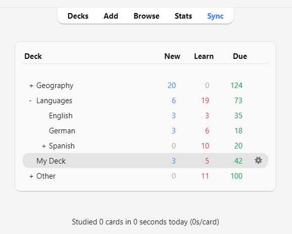

# 学習

<!-- toc -->

気に入ったデッキを見つけた場合や、いくつかのノートを入力した場合は、学習を始める時です。

## デッキ

Ankiでの学習は、現在選択されているデッキおよびそのサブデッキに限定されます。

デッキ画面では、デッキとサブデッキがリストに表示されます。その日の[新規、習得中、および復習予定](getting-started.md#カードタイプ)のカードもここに表示されます。

デッキをクリックすると、それが「現在のデッキ」となり、Ankiは学習画面に切り替わります。メインウィンドウの上部にある「デッキ」をクリックすることで、いつでもデッキリストに戻り、現在選択されているデッキを変更できます。（メニューの「デッキを学習」アクションを使用して、キーボードから新しいデッキを選択することもできますし、<kbd>s</kbd>キーを押して現在選択されているデッキを学習することもできます。）

デッキの右側にある歯車ボタンをクリックすると、デッキの名前を変更したり、削除したり、[オプション](deck-options.md)を変更したり、[エクスポート](exporting.md)することができます。

## 学習概要

デッキをクリックすると、今日のカードの予定数が表示される画面が表示されます。これを「デッキ概要」画面と呼びます：

カードは[3つのタイプ](getting-started.md#カードタイプ)に分かれています：新規、習得中、および復習予定。
デッキオプションで[兄弟関係のカードを非表示](#兄弟カードと埋める)を有効にしている場合、当日に非表示となるカードの数が灰色で表示されることがあります：

学習セッションを開始するには、**学習開始**ボタンをクリックします。Ankiはその日のカードがなくなるまでカードを表示し続けます。

学習中に、キーボードの<kbd>s</kbd>キーを押すと、概要に戻ることができます。

## 質問

カードが表示されるとき、最初に表示されるのは質問のみです。答えを考えた後、**解答を表示**ボタンをクリックするか、スペースバーを押します。すると答えが表示されます。答えを思い出すのに少し時間がかかっても構いませんが、一般的なルールとして、約10秒以内に答えられない場合は、無理に思い出そうとするよりも答えを表示した方が良いでしょう。

答えが表示されたら、自分が考えた答えと表示された答えを比較し、どれだけ覚えていたかをAnkiに伝える必要があります。自分の答えを正確に比較する自信がない場合は、Ankiに[答えを入力するように促す](templates/fields.md#答えの確認)こともできます。

## 習得中/再習得中カード

新規カードを学習する場合や、忘れてしまったカードを再学習する場合、Ankiはカードを1回以上表示して覚えるのを助けます。各回は「習得ステップ」と呼ばれます。デフォルトでは、1分と10分の2つのステップがあります。ステップの数とその間の遅延は[デッキオプション](deck-options.md#新しいカード)で変更できます。

習得中には4つの評価ボタンがあります：

- 「**もう一度**」はカードを最初のステップに戻します。

- 「**難しい**」は現在のステップを繰り返します。
  - カードが最初（かつ唯一）のステップにある場合、遅延はステップの50%長くなります。ただし、この遅延はステップより1日以上長くなることはありません。
  - カードが最初のステップにあり、複数のステップを設定している場合、遅延は「もう一度」と「正解」の平均、つまり最初の2つのステップの平均になります。
  - カードが最初のステップ以外のステップにある場合、「難しい」は前の遅延を繰り返します。

- 「**正解**」はカードを[次のステップ](deck-options.md#学習ステップ)に進めます。カードが最終ステップにある場合、カードは復習カードに変わります（「卒業」します）。デフォルトでは、カードが習得ステップの最後に達すると、翌日に再び表示され、その後は徐々に長い遅延で表示されます（次のセクションを参照）。

- 「**簡単**」は残りのステップがあってもカードを即座に復習カードに変えます。[デフォルトでは](deck-options.md#簡単間隔)、カードは4日後に再び表示され、その後は徐々に長い遅延で表示されます。v1スケジューラーでは、「簡単」ボタンは再習得モードでは表示されません。これは「正解」と同じ間隔を与えるためです。 [v2スケジューラー+](https://shigeyukey.github.io/Anki-faqs-jp/the-anki-2.1-scheduler.html)では、再習得中のカードに対して「簡単」ボタンは間隔を1日延ばします。

カードが初めて表示されるとき、最初のステップから始まります。つまり、カードに対して初めて「**正解**」を選択すると、10分後にもう一度表示され、最初の1分のステップはスキップされます。しかし、「**もう一度**」を選択すると、カードは1分後に再び表示されます。

キーボードの<kbd>1</kbd>、<kbd>2</kbd>、<kbd>3</kbd>、<kbd>4</kbd>キーを使用して特定のボタンを選択できます。<kbd>1</kbd>は「**もう一度**」に対応しています。<kbd>Space</kbd>または<kbd>Enter</kbd>を押すと「**正解**」が選択されます。

他に表示するカードがない場合、Ankiは遅延が完全に経過していなくても学習カードを再び表示します。完全な学習遅延を待ちたい場合は、[設定>学習>習得学習の前倒し許容時間](preferences.md)でこの動作を変更できます。

## 復習カード

カードが以前に学習され、再び復習する準備ができたとき、回答を評価するための4つのボタンがあります：

- 「**もう一度**」は回答を不正解としてマークし、Ankiにそのカードを将来より頻繁に表示するように指示します。このカードは「忘却した」と見なされます。忘却した復習の処理方法については、[忘却](deck-options.md#忘却 )セクションを参照してください。

- 「**難しい**」はデフォルトで、前回よりも[少し長い遅延](deck-options.md#ハード間隔)でカードを表示し、Ankiにそのカードを将来より頻繁に表示するように指示します。

- 「**正解**」は、前回の遅延がちょうど良かったことをAnkiに伝え、カードの「易しさ」の値を上下に調整する必要がないことを示します。デフォルトの[復習開始時の「易しさ」](deck-options.md#初期の容易さ)では、カードは前回の約2.5倍の遅延で再び表示されます。例えば、前回カードを見るのに10日待った場合、次の遅延は約25日になります。

- 「**簡単**」は、遅延が短すぎたことをAnkiに伝えます。カードは[「正解」よりもさらに先の未来](deck-options.md#簡単ボーナス)にスケジュールされ、Ankiは将来そのカードを表示する頻度を減らします。「簡単」は遅延を急速に増加させるため、最も簡単なカードにのみ使用するのが最適です。通常は「正解」を選択することが多いでしょう。

学習カードと同様に、キーボードの<kbd>1</kbd>、<kbd>2</kbd>、<kbd>3</kbd>、<kbd>4</kbd>キーを使用して回答を選択できます。<kbd>スペースバーSpace</kbd>または<kbd>Enter</kbd>を押すと「**正解**」が選択されます。

アルゴリズムの仕組みについて詳しくは、[デッキオプション](deck-options.md)および[FAQ](https://shigeyukey.github.io/Anki-faqs-jp/what-spaced-repetition-algorithm.html)をご覧ください。

## 予定数

質問のみが表示されているとき、Ankiは画面の下部に6 + 9 + 59のような3つの数字を表示します。これらは新規カード（青）、習得中のカード（赤）、および復習カード（緑）を表しています。これらの数字を見たくない場合は、Ankiの[設定](preferences.md)でオフにすることができます。

v1スケジューラーでは、これらの数字はそのキュー内のすべてのカードを完了するために必要な_学習_の数を示しており、_カード_の数ではありません。失敗したカードに対して複数のステップが設定されている場合、そのカードを何度も表示する必要があるため、失敗すると数字は1以上増加します。

[v2スケジューラー](https://shigeyukey.github.io/Anki-faqs-jp/the-anki-2.1-scheduler.html)では、これらの数字は_カード_の数を示しているため、残りのステップに関係なく数字は常に1ずつ増加します。

答えが表示されると、Ankiは各ボタンの上に次にカードが表示される予定時間の推定値を表示します。推定値を見たくない場合は、Ankiの[設定](preferences.md)で無効にすることができます。

## ファズファクター

復習カードに回答すると、Ankiは、同じ日に回答したカードが同じ評価を受けた場合に一緒に固まって常に同じ日に復習されるのを防ぐために、少量のランダムな「ファズ」を適用します。このファズは[v3スケジューラー](https://shigeyukey.github.io/Anki-faqs-jp/the-2021-scheduler.html)が有効になっている場合に回答ボタンに表示されます。そのため、以前のバージョンを使用していて、選択したものと実際のカードの間隔にわずかなずれがある場合は、これが原因である可能性があります。

習得中カードにも最大5分の追加遅延が与えられ、常に同じ順序で表示されないようにしますが、回答ボタンには反映されません。この機能をオフにすることはできません。

## 編集とその他

左下の**編集**ボタンをクリックすると、現在のノートを編集できます。編集を終えると、学習画面に戻ります。編集画面は[ノートの追加](editing.md)画面と非常に似ています。

学習画面の右下には**その他**ボタンがあります。このボタンをクリックすると、現在のカードやノートに対して行える他の操作が表示されます：

- [**カードにフラグを付ける**](editing.md#フラグの使用)：カードに色付きの目印（旗のマーク）を追加するか、オフに切り替えます。フラグは学習中に表示され、ブラウズ画面でフラグ付きカードを検索できます。これは、後でカードに対して何らかのアクションを実行したい場合（例えば、家に帰ってから単語を調べるなど）に便利です。Anki 2.1.45以降を使用している場合、[ブラウザ](browsing.md)からフラグの名前を変更することもできます。

- **カードを今日は非表示/ノートを今日は非表示**: 一枚のカード または 一個のノートのすべてのカード を翌日まで学習画面で隠します。
  （それまでにカードを表示したい場合は、[デッキ概要](studying.md#学習概要)画面の「非表示を解除」ボタンを押してください。）この機能は、今すぐにカードに答えられない場合や、後で再度確認したい場合に便利です。「今日は非表示」は、同じノートのカードに対して[自動的に適用](studying.md#兄弟カードと「今日は非表示」)することもできます。

  旧スケジューラーでは、カードが「今日は非表示」になったときに習得中であった場合、それらは「今日は非表示」になる前に新規カードキューまたは復習キューに戻されました。

  しかし、[2.1スケジューラー](https://shigeyukey.github.io/Anki-faqs-jp/the-anki-2.1-scheduler.html)では、カードを「今日は非表示」にしてもカードの学習ステップはリセットされません。

- **新規カードにリセット**: 現在のカードを[新規カードのキューの最後](browsing.md#カード)に移動します。

  Anki 2.1.50以降、v3スケジューラーを使用して最初に学習したときに、新規カードの元の順序をAnkiが記憶します。「可能な限り元の位置に復元」オプションを使用すると、カードをリセットしたときに元の位置にリセットできます。

  「学習回数と復習での忘却回数をリセット」オプションを有効にすると、カードの学習および復習での忘却のカウントがゼロにリセットされます。これは、カード情報画面の下部に表示される復習履歴を削除するものではありません。

- **期日を設定**: カードを復習キューに入れ、[特定の日に期日を設定します。](browsing.md#カード)

- **カード/ノートを休止**: カードまたはノートのすべてのカードを手動で休止解除（ブラウザで休止ボタンをクリック）するまで学習画面から隠します。これは、しばらくの間ノートを学習したくないが、削除はしたくない場合に便利です。旧スケジューラーでは、カードが習得中に休止された場合、それらは休止される前に新規カードキューまたは復習キューに戻されました。

  しかし、[2.1スケジューラー](https://shigeyukey.github.io/Anki-faqs-jp/the-anki-2.1-scheduler.html)では、カードを休止してもカードの習得ステップはリセットされません。

- **オプション**: 現在のデッキの[オプション](deck-options.md)を編集します。

- **カード情報**: カードに関する[統計情報](stats.md#カード情報)を表示します。

- **前のカード情報**: 前のカードに関する[統計情報](stats.md#カード情報)を表示します。

- [**ノートにマークを付ける**](editing.md#マーク済みタグ): 現在のノートに「marked」（＝マーク済み）タグを追加し、ブラウザで簡単に見つけられるようにします。これは個々のカードにフラグを付けるのと似ていますが、タグを使用するため、ノートに複数のカードがある場合、すべてのカードが「marked」タグの検索に表示されます。ほとんどのユーザーはフラグを使用することをお勧めします。

- **ノートを複製**: 現在のノートの[複製](browsing.md#重複の検索)をエディタで開きます。これにより、カードのバリエーションを簡単に取得するために少し修正することができます。デフォルトでは、複製カードは元のカードと同じデッキに作成されます。

- **ノートを削除**: ノートとそのすべてのカードを削除します。

- **音声を再生**: カードの表または裏にオーディオがある場合、それを再生します。

- **音声を一時停止**: 再生中のオーディオを一時停止します。

- **音声を5秒戻す / 音声を5秒進める**: 現在再生中のオーディオを5秒戻す/進める。

- **自分の声を録音**: 発音を確認するためにマイクから録音します。この録音は一時的なもので、次のカードに移動すると消えます。カードに音声を永久に追加したい場合は、編集ウィンドウで行うことができます。

- **自分の声を再生**: 自分の声の前回の録音を再生します（答えを表示した後に再生することを想定しています）。

## 表示順序

学習では、選択したデッキおよびその中に含まれるデッキのカードが表示されます。したがって、「フランス語」デッキを選択すると、「フランス語::語彙」や「フランス語::私の教科書::レッスン1」のサブデッキも表示されます。

Ankiがデッキからカードを取得する方法は、使用されるアルゴリズムによって異なります：

- v1スケジューラーを使用している場合、デッキにサブデッキがあると、カードは[各デッキから順番に](studying.md#表示順序)表示されます。

- [v2スケジューラー](https://shigeyukey.github.io/Anki-faqs-jp/the-anki-2.1-scheduler.html)を使用している場合、デッキにサブデッキがあると、カードはすべての子デッキから一度に取得されます。子デッキの枚数制限は無視され、クリックしたデッキの制限のみが適用されます。

- [v3スケジューラー](https://shigeyukey.github.io/Anki-faqs-jp/the-2021-scheduler.html)を使用している場合、各子デッキの制限も適用され、デッキ順にカードを表示する必要もありません。詳細については、マニュアルの[デッキオプション](deck-options.md#復習のソート順序)セクションを参照してください。

デフォルトでは、新しいカードの場合、Ankiはデッキからアルファベット順にカードを取得します。したがって、上記の例では、最初に「French」から、次に「My Textbook」、最後に「Vocab」からカードが取得されます。これを利用して、リストの上位に表示されるデッキに高優先度のカードを配置することで、カードの表示順序を制御できます。コンピュータがテキストをアルファベット順に並べ替えるとき、「-」文字はアルファベット文字の前に来て、「~」はその後に来ます。したがって、デッキを「-Vocab」と呼ぶことで最初に表示されるようにし、他のデッキを「~My Textbook」と呼ぶことで、すべての後に表示されるようにすることができます。

新規カードと復習カードは別々に取得され、Ankiは両方のキューが空になるまで次のデッキに進むのを待たないため、あるデッキの新規カードを見ている間に別のデッキの復習カードを見ることがあるかもしれません。これを避けたい場合は、親デッキの代わりに直接学習したいデッキをクリックしてください。

習得中のカードは時間に敏感なため、すべてのデッキから一度に取得され、期限順に表示されます。

特定のデッキからの復習の表示順序を制御したり、新規カードを順序付きからランダムに変更したりするには、[デッキオプション](deck-options.md)を参照してください。新規カードのより細かい順序付けについては、[ブラウザ](browsing.md)で順序を変更できます。

## 兄弟関係のカードの非表示

[基本](getting-started.md)から思い出してください。Ankiは、入力した内容に対して複数のカードを作成できます。例えば、表→裏のカードや裏→表のカード、または同じテキストからの2つの異なる穴埋め問題などです。これらの関連カードは「兄弟カード」と呼ばれます。

兄弟カードを持つカードに回答すると、Ankiはそのカードの兄弟カードが同じセッションで表示されないように自動的に「今日は非表示」にすることができます。「今日は非表示」となったカードは、新しい日になるまで、または[デッキ概要](studying.md#学習概要)画面の下部に表示される「非表示を解除」ボタンを使用して手動で解除するまで、学習画面には表示されません。兄弟カードが同じデッキにない場合でも（例えば、[デッキ選択を上書き](templates/intro.md)機能を使用している場合）、Ankiは兄弟カードを当日は非表示にします。

この機能は[デッキオプション](deck-options.md)画面から有効にできます。新規カードと復習カードのための個別の設定があります。

Ankiは、新規カードや復習カードである兄弟カードのみを自動的に「今日は非表示」にします。習得中のカードは学習タイミングの重要性が高いため、「今日は非表示」（つまり、翌日まで学習を保留）は行われません。一方、習得中のカードを学習すると、新規カードや復習カードである兄弟カードは当日は非表示となります。

注意：カードに「今日は非表示」と休止を同時に適用することはできません。「今日は非表示」になっているカードを休止すると、そのカードの「今日は非表示」は解除されます。Anki 2.1.49以降では、休止カードを「今日は非表示」にすることはできませんが、以前のバージョンではカードの休止が解除されます。

## キーボードショートカット

Ankiのほとんどの一般的な操作にはキーボードショートカットがあります。ほとんどのショートカットはインターフェースで確認できます：メニュー項目の横にはショートカットが表示されています。また、ボタンにマウスカーソルを合わせると、一般的にツールチップにショートカットが表示されます。

学習中は、<kbd>Space</kbd>または<kbd>Enter</kbd>を押すと答えが表示されます。答えが表示された後、<kbd>Space</kbd>または<kbd>Enter</kbd>を押すと「正解」ボタンが選択されます。<kbd>1</kbd>から<kbd>4</kbd>のキーを使用して特定の評価ボタンを選択することもできます。多くの人は、ほとんどのカードに<kbd>Space</kbd>で回答し、答えを忘れたときのために指を<kbd>1</kbd>に置いておくと便利だと感じています。

ツールメニューの「デッキを選択」項目を使用すると、キーボードでデッキを素早く切り替えることができます。<kbd>/</kbd>キーでこれをトリガーできます。開くと、すべてのデッキが表示され、上部にフィルターエリアが表示されます。文字を入力すると、Ankiは入力した文字をデッキ名に含むデッキのみを表示します。スペースを追加して複数の検索語を区切ることができ、Ankiはすべての検索語をデッキ名に含むデッキのみを表示します。例えば、「ja 1」や「on1 ja」はどちらも「Japanese::Lesson1」というデッキを表示します。

## 復習が遅れる場合

復習が遅れると、デフォルトではAnkiは最も長く待機しているカードを優先します。この順序付けにより、永久に表示されないまま待機し続けるカードが生じることを防ぎます。ただし、これにより、新規カードを追加しても、バックログ（期日を過ぎて待機している復習カード）を処理するまではそれらの新規カードは表示されません。

遅延した復習の順序を変更したい場合は、[フィルターデッキ](filtered-decks.md)を作成することで可能です。

長い間待っていたカードに回答するとき、Ankiは次にカードを表示する時間を決定する際にその遅延を考慮に入れます。詳細については、Ankiの間隔反復[アルゴリズム](https://shigeyukey.github.io/Anki-faqs-jp/due-times-after-a-break.html)に関するセクションを参照してください。
